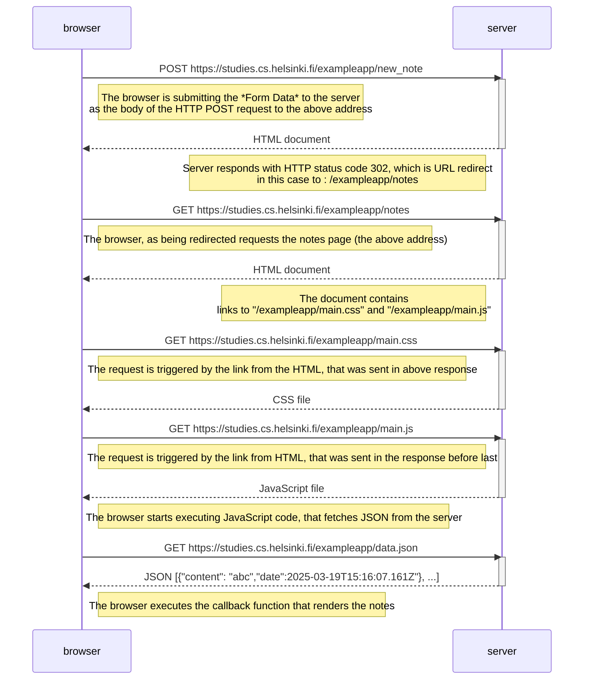

```mermaid

sequenceDiagram

participant browser
participant server


browser->>server: POST https://studies.cs.helsinki.fi/exampleapp/new_note
activate server
Note right of browser: The browser is submitting the *Form Data* to the server<br>as the body of the HTTP POST request to the above address

server-->>browser:HTML document
deactivate server
Note left of  server: Server responds with HTTP status code 302, which is URL redirect<br>in this case to : /exampleapp/notes


browser->>server: GET https://studies.cs.helsinki.fi/exampleapp/notes
activate server
Note right of browser: The browser, as being redirected requests the notes page (the above address)

server -->>browser: HTML document
deactivate server
Note left of server: The document contains<br>links to "/exampleapp/main.css" and "/exampleapp/main.js"


browser->>server: GET https://studies.cs.helsinki.fi/exampleapp/main.css
activate server
Note right of browser: The request is triggered by the link from the HTML, that was sent in above response

server-->>browser: CSS file
deactivate server


browser->>server: GET https://studies.cs.helsinki.fi/exampleapp/main.js
activate server
Note right of browser: The request is triggered by the link from HTML, that was sent in the response before last

server-->>browser: JavaScript file
deactivate server
Note right of browser: The browser starts executing JavaScript code, that fetches JSON from the server


browser->>server: GET https://studies.cs.helsinki.fi/exampleapp/data.json
activate server

server-->>browser: JSON [{"content": "abc","date":2025-03-19T15:16:07.161Z"}, ...]
deactivate server
Note right of browser: The browser executes the callback function that renders the notes

```