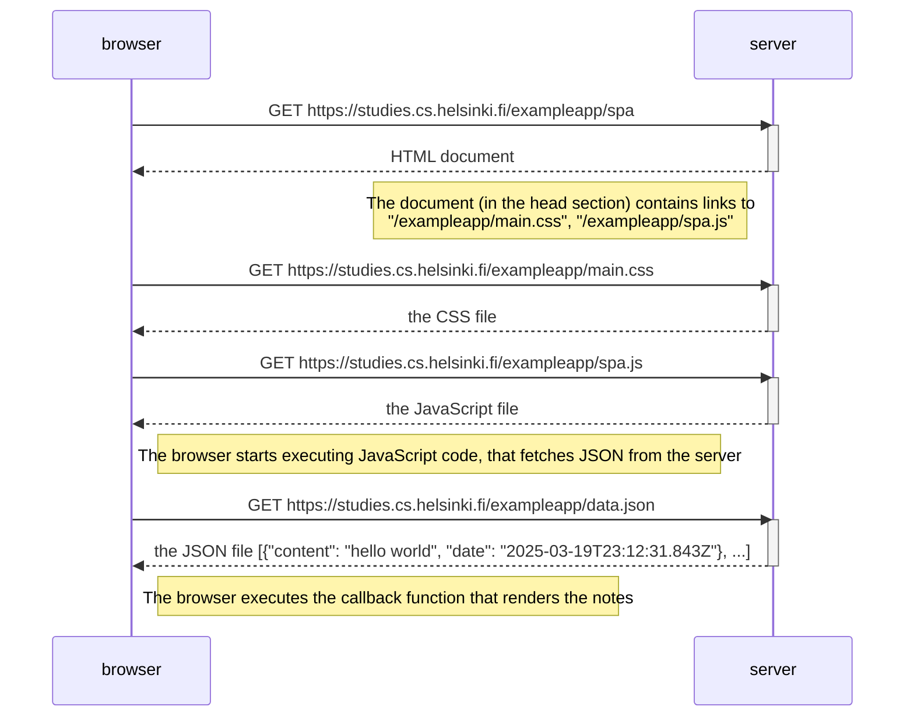

```mermaid

sequenceDiagram

participant browser
participant server

browser->>server: GET https://studies.cs.helsinki.fi/exampleapp/spa
activate server

server-->>browser: HTML document
deactivate server
Note left of server: The document (in the head section) contains links to<br>"/exampleapp/main.css", "/exampleapp/spa.js"


browser->>server: GET https://studies.cs.helsinki.fi/exampleapp/main.css
activate server

server-->>browser: the CSS file
deactivate server


browser->>server: GET https://studies.cs.helsinki.fi/exampleapp/spa.js
activate server

server-->>browser: the JavaScript file
deactivate server
Note right of browser: The browser starts executing JavaScript code, that fetches JSON from the server


browser->>server: GET https://studies.cs.helsinki.fi/exampleapp/data.json
activate server

server-->>browser: the JSON file [{"content": "hello world", "date": "2025-03-19T23:12:31.843Z"}, ...]
deactivate server
Note right of browser: The browser executes the callback function that renders the notes

```