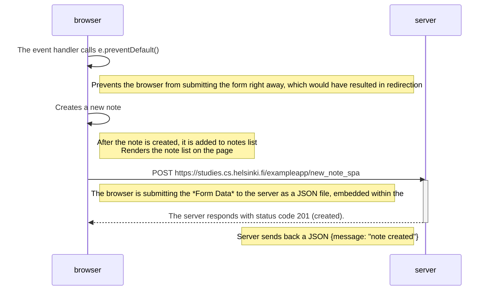

```mermaid

sequenceDiagram

participant browser
participant server


browser->>browser: The event handler calls e.preventDefault()
Note right of browser: Prevents the browser from submitting the form right away, which would have resulted in redirection


browser->>browser: Creates a new note
Note right of browser: After the note is created, it is added to notes list<br>Renders the note list on the page


browser->>server: POST https://studies.cs.helsinki.fi/exampleapp/new_note_spa
activate server
Note right of browser: The browser is submitting the *Form Data* to the server as a JSON file, embedded within the 

server-->>browser: The server responds with status code 201 (created).
deactivate server
Note left of server: Server sends back a JSON {message: "note created"}

```